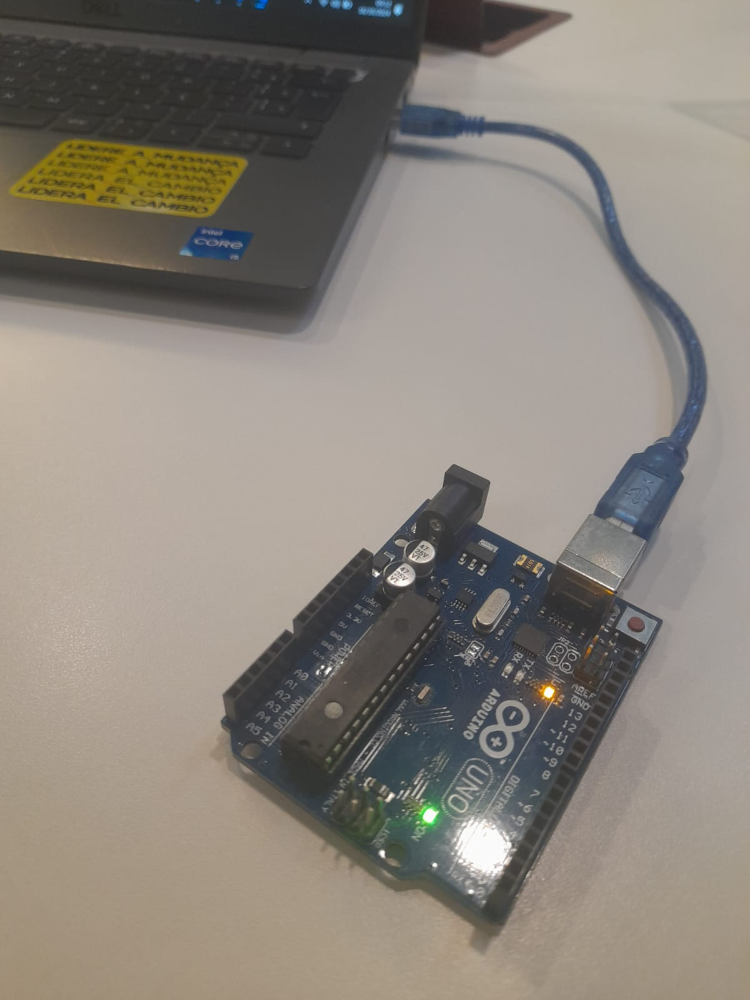
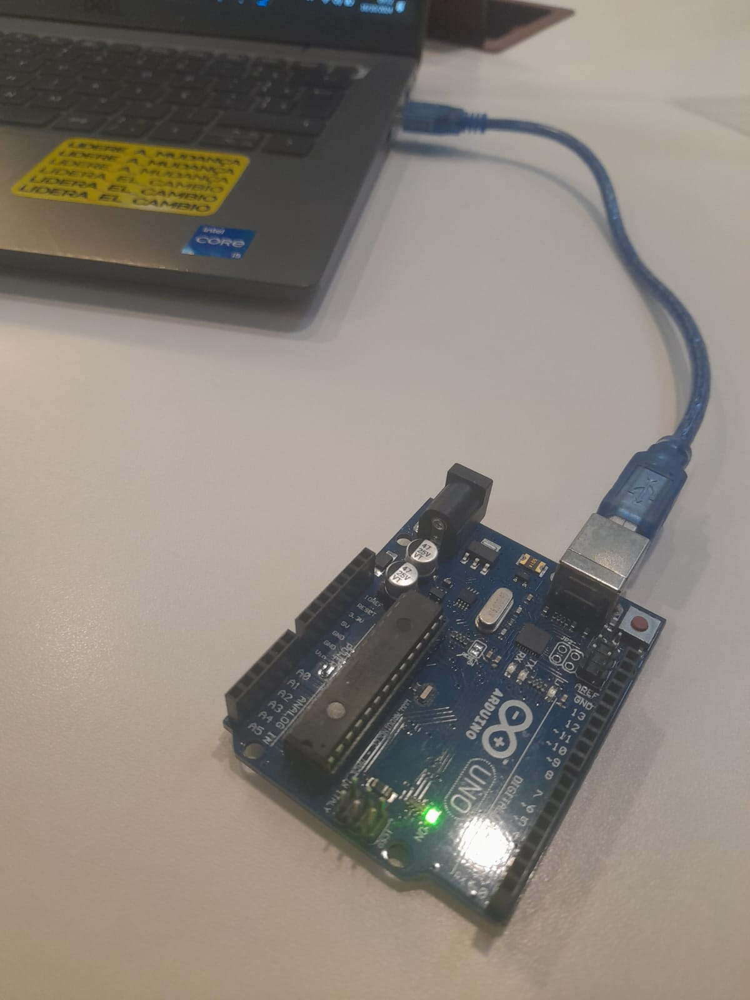
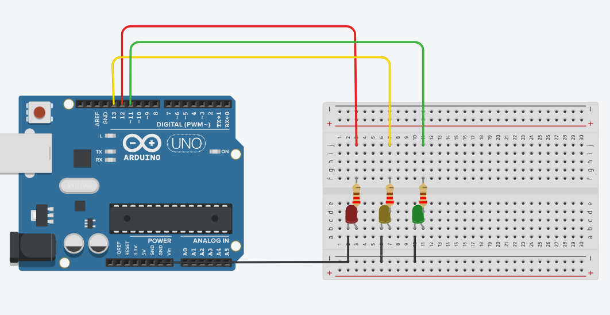

# Ponderada de Programação

&nbsp;&nbsp;&nbsp;&nbsp;Este repositório foi criado para o desenvolvimento da atividade de programação da semana 01, do módulo 4, do aluno Davi Nascimento de Jesus. A atividade foi feita sob a orientação da Prof. Me. Kizzy Terra. Tanto a parte pré-instrução quanto a parte pós-encontro. A atividade pode ser encontrada abaixo:

## Parte 1: Blink Led Interno

&nbsp;&nbsp;&nbsp;&nbsp;Nessa primeira atividade, referente a fazer o led interno piscar, foi desenvolvido o segundo código na IDE do arduíno:

Figura 1 - Código para a Primeira Atividade

Fonte: Material produzido pelos autores (2024)

&nbsp;&nbsp;&nbsp;&nbsp;Há a parte de inicialização, onde é colocado o led do próprio arduíno como saída, bem como os comandos de acender e apagar. O tempo de delay de 1000ms ou 1s é incorporado entre os comandos.

&nbsp;&nbsp;&nbsp;&nbsp;Como comprovação dessa primeira atividade, coloca-se os registros imagéticos a seguir:

Figura 2 - Led Interno do Arduíno Apagado

Fonte: Material produzido pelos autores (2024)

Figura 3 - Led Interno do Arduíno Aceso

Fonte: Material produzido pelos autores (2024)

&nbsp;&nbsp;&nbsp;&nbsp;Além disso, foi gravado um vídeo demonstrativo do arduíno piscando no link abaixo:

Vídeo 1 - Demonstração do Arduíno Piscando

[🖱️| Clique aqui para acessar o vídeo no Google Drive](https://drive.google.com/file/d/1YLILzls1FZ9CK-lvx47PX9klmbzjKMhv/view?usp=sharing)

Fonte: Material produzido pelos autores (2024)

&nbsp;&nbsp;&nbsp;&nbsp;Com esses registros, então, conclui-se a primeira parte da atividade desenvolvida. Tornou-se possível a identificação através desse passo como que funciona um código para o led interno do arduíno.

## Parte 2: Simulando Blink Externo

&nbsp;&nbsp;&nbsp;&nbsp;Para o desenvolvimento da segunda atividade, do Blink Externo, desenvolveu-se um projeto de semafóro, conforme instruções, no tinkercad. O semáforo segue as proporções dos períodos de um semáforo na vida real, ficando 5s no verde, 3s no vermelho e 1s no amarelo. Você pode conferir o projeto ao clicar na imagem abaixo que redireciona para o projeto no simulador.

Figura 4 - Projeto desenvolvido no simulador Tinkercad (Clique na imagem para acessar)

Fonte: Material produzido pelos autores (2024)

&nbsp;&nbsp;&nbsp;&nbsp;Além disso, para proporcionar um entendimento mais abrangente, foi desenvolvido com o mesmo código do simulador, o sistema físico do Blink Externo. Ele pode ser visualizado aqui:

Vídeo 2 - Demonstração do Semáforo Blink

[🖱️| Clique aqui para acessar o vídeo no Google Drive](https://drive.google.com/file/d/19r1Zl5a8U6-rwNr_7f54qW3ZovTjvvwv/view?usp=drive_link)

Fonte: Material produzido pelos autores (2024)

&nbsp;&nbsp;&nbsp;&nbsp;Com esses registros, então, conclui-se a segunda parte da atividade desenvolvida. Foi possível verificar através dela a utilização do processo de Blink em mais de um Led, externo à placa do arduíno.